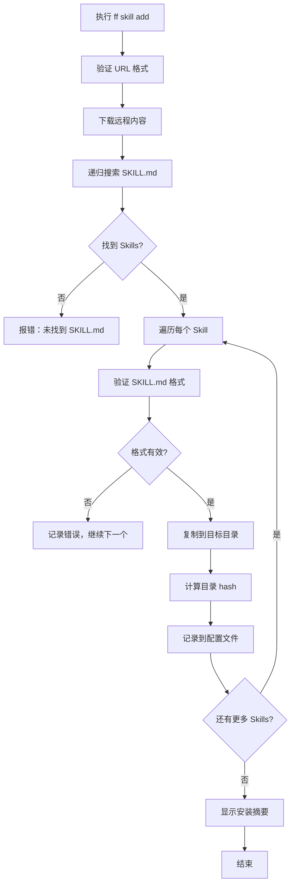

# Skill 功能开发计划

## 项目概述

**功能名称**: Agent Skills 管理系统
**开发日期**: 2025-11-19
**目标**: 为 Claude AI 助手添加 Skill 管理功能，支持从远程 URL 安装、管理和分享 Skills

## 一、背景与需求

### 1.1 什么是 Agent Skills

根据 Claude 官方文档，Agent Skills 是：
- **模块化功能包**：扩展 Claude 能力的模块化功能包
- **自主调用**：Claude 自主决定何时使用（model-invoked），非 slash 命令
- **核心文件**：每个 Skill 必须包含 `SKILL.md` 文件
- **渐进披露**：Claude 只读取需要的文件，优化上下文使用
- **共享能力**：支持团队共享专业技能和工作流程

### 1.2 需求分析

**功能需求**：
- 支持从 GitHub 仓库或任意 URL 安装 Skill
- 自动递归搜索包含 SKILL.md 的目录
- 支持全局安装（Personal Skills）和项目级安装（Project Skills）
- 支持指定目标 agent（目前仅支持 claude）
- 支持 Skill 的增删改查操作
- 与现有 Provider 配置系统集成

**技术需求**：
- 避免直接使用 `sub.json` 配置，而是使用 `skill.json` 存储skill信息
- 使用现有 Storage、Logger 等核心模块
- 保持与现有命令风格一致

## 二、命令设计

### 2.1 命令结构

```
ff skill add <url> -t claude -g
ff skill del <skill-name> -t claude -g
ff skill list [-t claude] [-g]
ff skill update <skill-name> -t claude -g
```

### 2.2 参数说明

- **url**: Skill 来源 URL
  - 支持 GitHub 仓库目录：`https://github.com/user/repo/tree/main/path/to/skill`
  - 支持分支指定：`/tree/main/`、`/tree/develop/`

- **-t, --target <agent>**: 目标 agent
  - 目前仅支持 `claude`
  - 未来可扩展支持其他 agent

- **-g, --global**: 安装范围
  - 使用 `-g`：全局安装（Personal Skills 到 `~/.claude/skills/`）
  - 不使用 `-g`：项目级安装（Project Skills 到项目根目录的 `.claude/skills/`）

**注意**：本地安装时会自动查找项目根目录（向上遍历查找包含 `package.json`、`.git`、`.ff` 或 `src` 的目录），因此无论在项目的哪个子目录下执行命令，Skill 都会安装到项目根目录。这与 `npm install` 的行为一致。

### 2.3 预期行为

**ff skill add**：
1. 访问指定 URL
2. 递归搜索所有包含 SKILL.md 的目录
3. 对每个找到的 Skill：
   - 验证 SKILL.md 格式
   - 复制整个目录到目标位置
   - 记录到配置文件
4. 显示安装结果摘要

**ff skill del**：
1. 确认 Skill 存在
2. 显示确认提示
3. 删除 Skill 目录
4. 更新配置文件

**ff skill list**：
1. 列出指定 agent 的 Skills
2. 支持 `-g` 过滤全局/本地
3. 显示：名称、描述、来源、安装位置、更新时间

**ff skill update**：
1. 检查远程更新（比较 hash）
2. 下载更新文件（仅在有更新时）
3. 保留用户自定义配置

## 三、技术架构

### 3.1 目录结构

```
# 全局安装位置（Personal Skills）
~/.claude/skills/
└── {skill-name}/
    ├── SKILL.md (必需)
    ├── scripts/ (可选)
    ├── templates/ (可选)
    ├── reference.md (可选)
    └── 其他文件...

# 项目安装位置（Project Skills）
{project-root}/
└── .claude/skills/
    └── {skill-name}/
        ├── SKILL.md
        └── ...

# 配置文件
~/.ff/skill.json  # Skill 配置信息
~/.ff/sub.json    # Provider 配置信息（已有）
```

### 3.2 配置文件结构

**设计决策**：使用独立的 `~/.ff/skill.json` 存储所有 Skill 信息

**原因**：
- **职责分离**：Provider 配置（sub.json）和 Skill 配置属于不同维度的数据
- **可维护性**：避免配置文件过大，各自独立管理更清晰
- **扩展性**：未来可独立演进 Skill 功能，不影响 Provider 配置
- **容错性**：Skill 配置损坏不会影响 Provider 配置

**使用独立的 `~/.ff/skill.json`**：

```typescript
// src/types/skill.ts
export interface SkillInfo {
  // 基本信息
  name: string;                    // skill 名称（来自 SKILL.md）
  description: string;             // 描述（来自 SKILL.md）
  url: string;                     // 来源 URL

  // 安装信息
  targetAgent: 'claude';           // 目标 agent
  isGlobal: boolean;               // 是否全局安装
  installedAt: number;             // 安装时间（时间戳）
  lastUpdated: number;             // 最后更新时间（时间戳）
  hash: string;                    // 内容 hash（用于检测更新）
  localPath: string;               // 本地路径

  // 可选字段
  version?: string;                // 版本信息
  allowedTools?: string[];         // 允许的工具列表
}

/**
 * skill.json 的完整结构
 */
export interface SkillConfig {
  /** 所有已安装的 Skills */
  skills: Record<string, SkillInfo>;
}
```

### 3.3 核心类设计

**新增文件**：`src/core/skill-manager.ts`

```typescript
export class SkillManager {
  // 安装相关
  static async install(url: string, targetAgent: string, isGlobal: boolean): Promise<void>
  static async downloadFromUrl(url: string): Promise<string>
  static async searchRemoteSKILLMd(basePath: string): Promise<string[]>

  // 验证相关
  static validateSKILLMd(content: string): { valid: boolean; errors?: string[] }
  static extractSkillInfo(skillPath: string): Promise<SkillInfo>

  // 卸载相关
  static async uninstall(skillName: string, targetAgent: string, isGlobal: boolean): Promise<void>

  // 列表相关
  static async list(targetAgent?: string, isGlobal?: boolean): Promise<SkillInfo[]>

  // 更新相关
  static async update(skillName: string, targetAgent: string, isGlobal: boolean): Promise<void>

  // 工具方法
  static getSkillPath(skillName: string, targetAgent: string, isGlobal: boolean): string
  static calculateDirectoryHash(dirPath: string): Promise<string>
  static findProjectRoot(startPath: string): string  // 查找项目根目录
}
```

**项目根目录查找机制**：

为了确保 Skill 始终安装到正确的项目根目录（而非当前工作目录），实现了 `findProjectRoot()` 方法：

```typescript
static findProjectRoot(startPath: string): string {
  let currentPath = startPath;

  while (currentPath !== path.dirname(currentPath)) {
    // 检查是否包含项目标识文件
    const hasPackageJson = fs.existsSync(path.join(currentPath, 'package.json'));
    const hasGitDir = fs.existsSync(path.join(currentPath, '.git'));
    const hasFfConfig = fs.existsSync(path.join(currentPath, '.ff'));
    const hasSrcDir = fs.existsSync(path.join(currentPath, 'src'));

    if (hasPackageJson || hasGitDir || hasFfConfig || hasSrcDir) {
      return currentPath;
    }

    currentPath = path.dirname(currentPath);
  }

  return startPath;
}
```

**识别项目根目录的标识**：
1. `package.json` - Node.js 项目标准文件
2. `.git` - Git 仓库目录
3. `.ff` - Flyfree 配置文件目录
4. `src` - 源代码目录（适用于大多数项目）

这个机制与 `npm install` 的行为一致，确保无论从项目的哪个子目录执行命令，Skill 都会安装到正确的项目根目录。
```

### 3.4 命令文件

**新增文件**：
- `src/commands/skill/index.ts` - skill 命令组入口
- `src/commands/skill/add.ts` - skill add 子命令
- `src/commands/skill/del.ts` - skill del 子命令
- `src/commands/skill/list.ts` - skill list 子命令
- `src/commands/skill/update.ts` - skill update 子命令

## 四、详细实现方案

### 4.1 Skill 添加流程



**关键实现点**：

1. **URL 处理**：
   ```typescript
   // GitHub 仓库 URL 转换示例
   // 输入：https://github.com/user/repo/tree/main/skills/my-skill
   // 输出：https://raw.githubusercontent.com/user/repo/main/skills/my-skill/
   ```

2. **递归搜索算法**：
   ```typescript
   async function searchSKILLMd(basePath: string): Promise<string[]> {
     const results = [];
     const entries = await fs.readdir(basePath);

     for (const entry of entries) {
       const fullPath = join(basePath, entry);
       const stat = await fs.stat(fullPath);

       if (stat.isDirectory()) {
         const skillMdPath = join(fullPath, 'SKILL.md');
         if (await fs.pathExists(skillMdPath)) {
           results.push(fullPath);
         }
         // 递归搜索子目录
         const subResults = await searchSKILLMd(fullPath);
         results.push(...subResults);
       }
     }

     return results;
   }
   ```

3. **SKILL.md 验证**：
   ```typescript
   function validateSKILLMd(content: string): ValidationResult {
     // 检查 YAML frontmatter
     const frontmatterRegex = /^---\s*\n([\s\S]*?)\n---\s*\n([\s\S]*)$/;
     const match = content.match(frontmatterRegex);

     if (!match) {
       return { valid: false, errors: ['缺少 YAML frontmatter'] };
     }

     const yamlContent = match[1];
     const yamlData = yaml.load(yamlContent);

     // 验证 name 字段
     if (!yamlData.name) {
       return { valid: false, errors: ['缺少 name 字段'] };
     }

     if (!/^[a-z0-9-]{1,64}$/.test(yamlData.name)) {
       return { valid: false, errors: ['name 必须是1-64位小写字母、数字或连字符'] };
     }

     // 验证 description 字段
     if (!yamlData.description) {
       return { valid: false, errors: ['缺少 description 字段'] };
     }

     if (yamlData.description.length > 1024) {
       return { valid: false, errors: ['description 最多1024字符'] };
     }

     return { valid: true, data: yamlData };
   }
   ```

### 4.2 Skill 列表展示

```typescript
// 示例输出
📚 Installed Skills (claude)

Global Skills (~/.claude/skills/):
  • pdf-processing
    Description: Extract text, fill forms, merge PDFs
    URL: https://github.com/llmapis/skills/pdf-tools
    Updated: 2025-11-19 10:30:00

  • code-reviewer
    Description: Review code for best practices
    URL: https://github.com/user/code-review-skill
    Updated: 2025-11-18 15:20:00

Local Skills (./.claude/skills/):
  • team-workflow
    Description: Standard team development workflow
    URL: https://github.com/company/team-skills
    Updated: 2025-11-17 09:00:00

Total: 3 Skills installed
```

### 4.3 更新检测机制

```typescript
async function checkForUpdates(skillInfo: SkillInfo): Promise<boolean> {
  try {
    const remoteHash = await calculateRemoteHash(skillInfo.url);
    return remoteHash !== skillInfo.hash;
  } catch (error) {
    Logger.warn(`Failed to check update for ${skillInfo.name}: ${error.message}`);
    return false;
  }
}
```

## 五、实现步骤

### 阶段 1：基础架构搭建

- [ ] **创建类型定义文件**
  - 创建 `src/types/skill.ts`
  - 定义 `SkillInfo` 和 `SkillConfig` 接口
  - 定义技能配置的完整结构

- [ ] **创建 SkillManager 核心类**
  - 创建 `src/core/skill-manager.ts`
  - 实现基础工具方法（路径计算、hash 计算等）

- [ ] **注册 skill 命令组**
  - 更新 `src/index.ts`
  - 添加 skill 主命令
  - 配置子命令结构

### 阶段 2：skill add 命令实现

- [ ] **实现 URL 验证与下载**
  - URL 格式验证
  - GitHub URL 自动转换
  - 文件下载功能

- [ ] **实现递归搜索**
  - 搜索 SKILL.md 文件
  - 过滤和验证找到的 Skills

- [ ] **实现安装逻辑**
  - 复制 Skill 目录到目标位置
  - 验证 SKILL.md 格式
  - 计算目录 hash
  - 更新 skill.json 配置文件

- [ ] **实现 skill add 子命令**
  - 创建 `src/commands/skill/add.ts`
  - 解析命令行参数
  - 调用 SkillManager.install()
  - 错误处理和用户提示

### 阶段 3：skill list 命令实现

- [ ] **实现列表查询**
  - 从 skill.json 读取 Skills 信息
  - 支持过滤（agent、global/local）

- [ ] **实现 skill list 子命令**
  - 创建 `src/commands/skill/list.ts`
  - 美化输出格式
  - 显示统计信息

### 阶段 4：skill del 命令实现

- [ ] **实现卸载逻辑**
  - 确认 Skill 存在
  - 删除 Skill 目录
  - 从 skill.json 移除记录

- [ ] **实现 skill del 子命令**
  - 创建 `src/commands/skill/del.ts`
  - 添加确认提示
  - 强制删除选项（-f, --force）

### 阶段 5：skill update 命令实现

- [ ] **实现更新检测**
  - 比较远程和本地 hash
  - 仅在有更新时下载

- [ ] **实现 skill update 子命令**
  - 创建 `src/commands/skill/update.ts`
  - 支持更新所有 Skills（无参数时）
  - 显示更新进度

### 阶段 6：测试与优化

- [ ] **单元测试**
  - 测试 SkillManager 核心方法
  - 测试 SKILL.md 验证逻辑

- [ ] **集成测试**
  - 测试完整流程：add -> list -> update -> del
  - 测试 GitHub URL 处理
  - 测试全局/本地安装

- [ ] **边界测试**
  - 无效 URL
  - 无 SKILL.md 的情况
  - 重复安装同名 Skill
  - 权限不足场景

- [ ] **用户体验优化**
  - 添加进度条显示下载进度
  - 美化错误提示信息
  - 添加 `--verbose` 调试选项

## 六、与现有系统集成

### 6.1 使用现有模块

- **Storage 类**：
  - 新增 `readSkillConfig()` 和 `writeSkillConfig()` 方法处理 `skill.json`
  - 使用 `ensureDir()`、`copy()`、`remove()` 等方法管理 Skill 目录
  - 与 Provider 配置完全分离

- **Logger 类**：
  - 使用 `Logger.info()`、`Logger.success()`、`Logger.error()` 输出信息
  - 保持与现有命令一致的输出风格

- **常量定义**：
  - 在 `src/constants/index.ts` 添加 Skill 相关常量
  - `SKILL_CONFIG_FILE`: `~/.ff/skill.json` 路径
  - Skill 目录路径常量

### 6.2 配置兼容

- Skills 配置使用独立的 `~/.ff/skill.json` 文件
- 与 Provider 配置（`sub.json`）完全分离
- 不影响现有 Provider 功能
- 分离设计使配置文件更清晰，维护更容易

### 6.3 命令风格统一

- 保持与 `sub`、`unsub`、`list` 等命令相同的风格
- 使用相同的颜色标识（`chalk`）
- 错误处理方式一致

## 七、验证规则

### 7.1 SKILL.md 验证规则

- **必含元素**：
  - YAML frontmatter（`---` 包裹）
  - `name` 字段（必填）
  - `description` 字段（必填）

- **name 字段规则**：
  - 仅允许：小写字母、数字、连字符（`-`）
  - 长度：1-64 字符
  - 不得包含空格或特殊字符

- **description 字段规则**：
  - 必填
  - 长度：最多 1024 字符
  - 用于 Claude 自主发现 Skill，应尽量具体

- **可选字段**：
  - `allowed-tools`：指定允许使用的工具列表
  - `version`：版本信息

- **YAML 语法**：
  - 使用空格缩进（不接受 Tab）
  - 正确闭合 `---`
  - 有效 YAML 格式

### 7.2 URL 验证规则

- **支持的格式**：
  - GitHub 仓库目录
  - 直接下载链接
  - GitLab、其他 Git 托管服务

- **验证点**：
  - URL 格式正确
  - 可以访问
  - 包含有效的 SKILL.md 文件

### 7.3 安装路径验证

- **全局安装**：
  - 路径：`~/.claude/skills/{skill-name}/`
  - 权限：可读写 home 目录

- **本地安装**：
  - 路径：`{project-root}/.claude/skills/{skill-name}/`
  - 权限：可读写当前目录

## 八、错误处理

### 8.1 常见错误场景

| 错误类型 | 触发场景 | 解决方案 |
|---------|---------|---------|
| URL 无法访问 | 网络问题、URL 错误 | 显示错误信息，提供重试建议 |
| 找不到 SKILL.md | URL 指向错误位置 | 递归搜索后仍无结果，提示检查 URL |
| SKILL.md 格式无效 | YAML 语法错误、缺少字段 | 显示具体验证错误，指导修复 |
| Skill 名称冲突 | 已安装同名 Skill | 询问是否覆盖，或提示使用不同名称 |
| 权限不足 | 无法写入目标目录 | 显示权限错误，建议使用 sudo 或修改权限 |
| 目标 agent 不支持 | 使用 `-t` 指定不支持的 agent | 显示支持的 agent 列表 |

### 8.2 错误输出格式

```typescript
// 示例错误输出
✗ Failed to install skill from: https://github.com/user/repo/skills/pdf-tool

Error: No SKILL.md found in the repository

Hint:
  • Check if the URL points to a directory containing SKILL.md
  • Ensure the repository is public and accessible
  • Try: https://github.com/user/repo/tree/main/skills/pdf-tool

For more help, run: ff skill --help
```

## 九、依赖项

### 9.1 现有依赖（已安装）

- `axios`: HTTP 请求
- `fs-extra`: 文件系统操作
- `commander`: 命令行框架
- `chalk`: 终端颜色输出
- `ora`: 进度条显示

### 9.2 新增依赖

```json
{
  "dependencies": {
    "js-yaml": "^4.1.0"  // YAML 解析和验证
  }
}
```

**说明**：
- `js-yaml` 用于解析和验证 SKILL.md 中的 YAML frontmatter
- Node.js 18+ 内置 `crypto` 用于计算 hash

## 十、测试用例

### 10.1 单元测试用例

1. **SKILL.md 验证测试**
   - 有效 SKILL.md
   - 缺少 frontmatter
   - 无效 name 字段
   - 无效 description 字段
   - 无效 YAML 语法

2. **URL 处理测试**
   - GitHub URL 转换
   - 无效 URL 格式
   - 无法访问的 URL

3. **路径计算测试**
   - 全局路径计算
   - 本地路径计算
   - 跨平台兼容性（Windows/macOS/Linux）

### 10.2 集成测试用例

1. **完整流程测试**
   - add -> list -> update -> del
   - 全局安装流程
   - 本地安装流程

2. **GitHub 集成测试**
   - 从真实 GitHub 仓库安装
   - 处理大仓库
   - 处理私有仓库（预期失败）

3. **并发测试**
   - 同时安装多个 Skills
   - 并发更新

### 10.3 边界测试用例

1. **空场景**
   - 空的 GitHub 仓库
   - 无 SKILL.md 的仓库

2. **冲突场景**
   - 重复安装同名 Skill
   - 覆盖安装

3. **权限场景**
   - 只读目录
   - 无写入权限

## 十一、性能优化

### 11.1 下载优化

- **并行下载**：多个文件并行下载
- **缓存机制**：缓存已下载的内容，减少重复请求
- **断点续传**：大文件支持断点续传

### 11.2 搜索优化

- **延迟搜索**：仅在需要时递归搜索
- **结果缓存**：缓存搜索结果，避免重复搜索

### 11.3 存储优化

- **增量更新**：仅下载变更的文件
- **压缩存储**：支持压缩包格式安装

## 十二、文档和示例

### 12.1 用户文档

- 更新 `docs/USER_GUIDE.md` 添加 Skill 相关章节
- 添加 Skill 使用示例
- 添加常见问题解答

### 12.2 示例 Skills

创建示例 Skill 仓库：`https://github.com/llmapis/skills`

示例：
- `pdf-processing`: PDF 处理工具
- `code-reviewer`: 代码审查助手
- `commit-helper`: 提交信息生成器

### 12.3 开发者文档

- 在 `docs/` 目录添加 Skill 开发指南
- 说明如何创建和分享 Skill
- 最佳实践文档

## 十三、里程碑计划

### 里程碑 1：基础架构（预计 1 天）

- [x] 创建类型定义
- [x] 实现 SkillManager 基础框架
- [x] 注册命令组

### 里程碑 2：skill add 命令（预计 2 天）

- [x] 实现下载功能
- [x] 实现搜索功能
- [x] 实现验证和安装
- [x] 完成 skill add 子命令

### 里程碑 3：skill list 命令（预计 0.5 天）

- [x] 实现列表查询
- [x] 完成 skill list 子命令

### 里程碑 4：skill del 命令（预计 0.5 天）

- [x] 实现卸载功能
- [x] 完成 skill del 子命令

### 里程碑 5：skill update 命令（预计 1 天）

- [x] 实现更新检测
- [x] 实现增量更新
- [x] 完成 skill update 子命令

### 里程碑 6：测试与优化（预计 1 天）

- [x] 单元测试
- [x] 集成测试
- [x] 性能优化
- [x] 用户体验优化

**总计预计时间**：5 天

## 十四、风险评估

### 14.1 技术风险

| 风险 | 概率 | 影响 | 缓解措施 |
|------|------|------|---------|
| GitHub API 变更 | 低 | 中 | 使用 raw.githubusercontent.com 直接下载 |
| YAML 解析失败 | 中 | 中 | 增加详细错误提示和调试信息 |
| 大仓库性能问题 | 中 | 中 | 添加超时和大小限制 |
| 跨平台路径问题 | 低 | 高 | 充分测试各平台，使用 path.join() |

### 14.2 依赖风险

- **js-yaml 库**：成熟稳定，风险低
- **GitHub 服务稳定性**：GitHub 稳定，备选方案使用其他 Git 托管服务

### 14.3 进度风险

- **测试时间不足**：预留缓冲时间，优先保证核心功能
- **需求变更**：保持代码模块化，便于调整

## 十五、总结

本开发计划基于 Claude 官方 Agent Skills 文档，设计了一个完整的 Skill 管理系统。该系统：

1. **功能完整**：覆盖 Skill 的完整生命周期（增删改查）
2. **架构合理**：与现有系统无缝集成，使用现有模块
3. **用户友好**：命令风格统一，错误提示清晰
4. **可扩展性**：支持未来添加更多 agent 和功能
5. **测试充分**：包含单元测试、集成测试和边界测试

该功能将极大地提升用户使用 Claude AI 的效率，支持快速安装和使用社区分享的专业技能，同时也方便团队共享工作流程和最佳实践。

---

**开发计划版本**：v1.0
**创建日期**：2025-11-19
**最后更新**：2025-11-19
